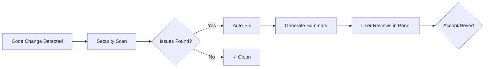
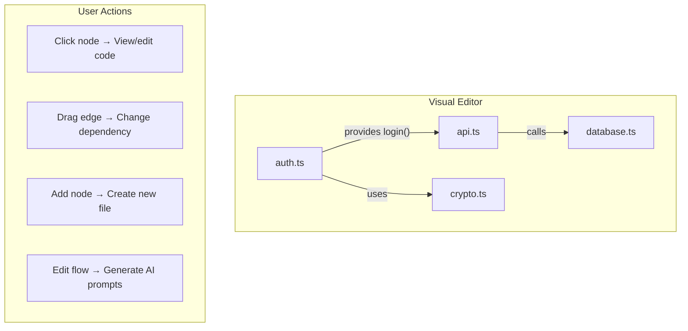
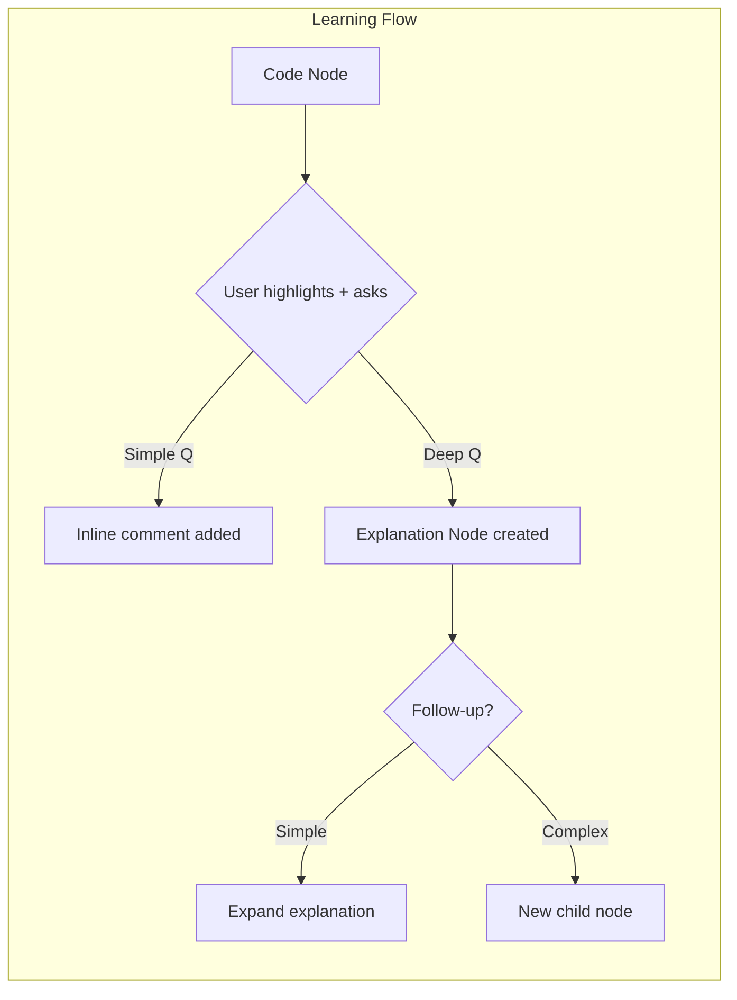
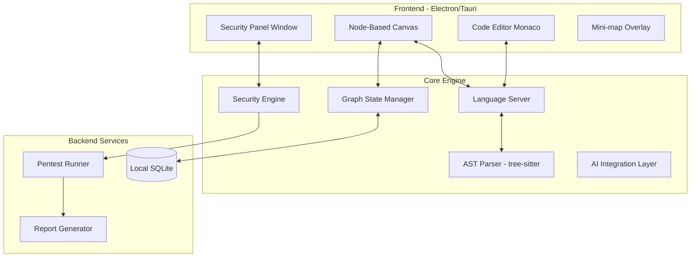
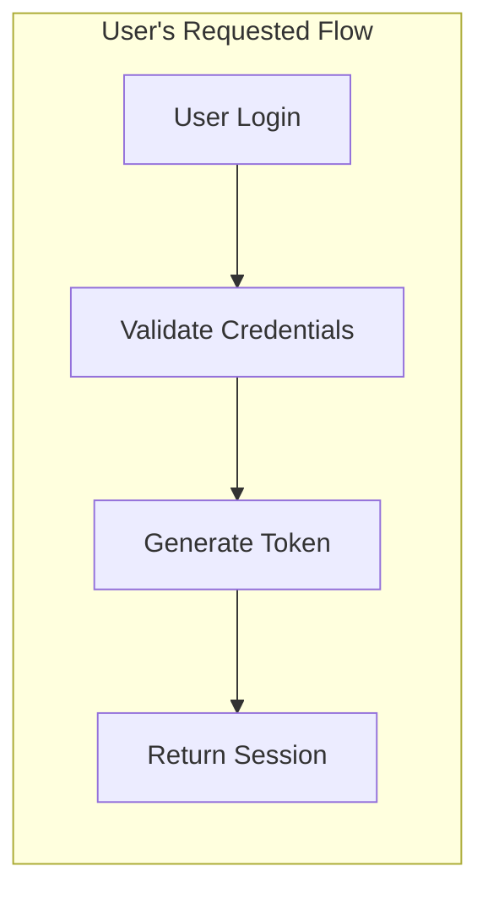
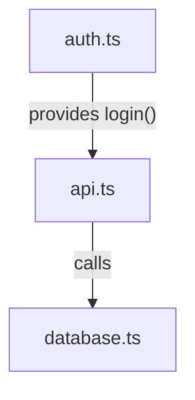
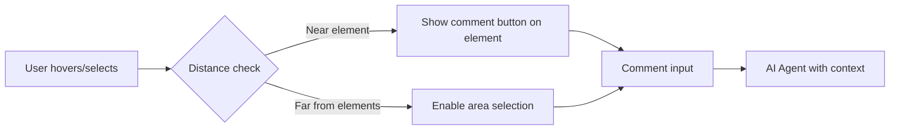

# BackBrain Implementation Plans

This document contains the complete evolution of BackBrain's product planning, including all diagrams and details.

---

# Version 1: Initial Vision

> Created: 2024-12-07

## 1. Product Overview

### Core Value Proposition
BackBrain is a **proactive guardian** for AI-generated code that:
1. **Catches what AI misses** — hallucinations, inconsistencies, deprecated patterns
2. **Fixes security issues automatically** — then explains what it did
3. **Visualizes your codebase** — as an interactive, editable graph
4. **Teaches as you build** — contextual learning without leaving the flow

### Key Differentiators
| Traditional Tools | BackBrain |
|-------------------|-----------|
| Flag problems, user fixes | Auto-fix + show summary + easy revert |
| Text-based file tree | Interactive node graph as primary UX |
| Separate learning resources | Inline education that grows with questions |
| Manual pentesting | Integrated, automated security audits |

---

## 2. Core Features

### 2.1 Security Guardian Engine



**Capabilities:**
- Real-time vulnerability detection (OWASP Top 10, CWE, supply chain)
- Automatic fixes with one-click revert
- Severity classification (Critical → Info)
- Separate "Security Panel" window for professional feel

**Libraries to evaluate:**
- [Semgrep](https://github.com/semgrep/semgrep) — LGPL-2.1, 10k+ stars, customizable rules
- [Snyk Code](https://snyk.io/) — commercial but has free tier
- [Bandit](https://github.com/PyCQA/bandit) (Python), [ESLint security plugins](https://github.com/eslint-community/eslint-plugin-security)

---

### 2.2 AI Error Detection System

**Problems we catch:**

| Category | Example | Detection Method |
|----------|---------|------------------|
| **Name Mismatches** | `userService` vs `UserService` | AST cross-reference |
| **Flow Gaps** | Missing error handler in async chain | Control flow analysis |
| **Deprecated APIs** | Using `componentWillMount` | Version-aware linting |
| **Missing Dependencies** | Importing uninstalled package | Package manifest validation |
| **Style Inconsistency** | Mixed tabs/spaces, naming conventions | Configurable style rules |
| **Logic Errors** | Condition always true/false | Static analysis + heuristics |

**Implementation approach:**
- Build on Language Server Protocol (LSP) for IDE integration
- Use tree-sitter for fast, accurate AST parsing
- Integrate with package managers (npm, pip, cargo) for dependency checks

---

### 2.3 Node-Based Visualization System

> The **primary interface** — files become nodes, imports become edges.



**Features:**
- **View modes**: Full graph, focused subgraph, dependency tree
- **Edit operations**: Drag to connect, click to edit inline, double-click for full editor
- **AI integration**: Visual edits → prompt generation → implement changes
- **Mini-map**: Always-visible overview in corner during traditional editing

**Libraries to evaluate:**
- [React Flow](https://reactflow.dev/) — MIT, 25k+ stars, production-ready
- [Cytoscape.js](https://js.cytoscape.org/) — MIT, 10k+ stars, highly customizable
- [Rete.js](https://rete.js.org/) — MIT, 10k+ stars, node-based editor framework

---

### 2.4 Codebase Learning & Exploration



**Key behaviors:**
- Explanation nodes are visually distinct (dashed border, muted color)
- "Always apply" comments trigger codebase-wide mutation with subtle animation
- Question context preserved for follow-up understanding

**UX principle**: No tutorials. Discovery through intuitive interaction + micro-demos on first encounter with a feature.

---

### 2.5 Automated Pentesting & Reporting

**Workflow:**
1. User triggers "Full Security Audit"
2. BackBrain runs comprehensive tests (SAST, secrets scan, dependency audit)
3. Generates professional PDF/HTML report
4. Shows interactive summary in Security Panel

**Report sections:**
- Executive Summary (for stakeholders)
- Detailed Findings (for developers)
- Remediation Steps (actionable)
- Compliance Mapping (OWASP, SOC2, etc.)

**Libraries:**
- [OWASP ZAP](https://github.com/zaproxy/zaproxy) — Apache-2.0, for dynamic testing
- [Trivy](https://github.com/aquasecurity/trivy) — Apache-2.0, 23k+ stars, comprehensive scanner
- [Gitleaks](https://github.com/gitleaks/gitleaks) — MIT, secrets detection

---

## 3. Architecture Overview



### Technology Stack (v1 Proposed)

| Layer | Technology | Rationale |
|-------|------------|-----------|
| **Desktop Shell** | Tauri (Rust) | Smaller bundle, better performance than Electron |
| **Frontend** | React + TypeScript | Ecosystem, maintainability |
| **Node Canvas** | React Flow | Best React integration, MIT license |
| **Code Editor** | Monaco Editor | VS Code parity, extensible |
| **AST Parsing** | tree-sitter | Multi-language, fast, accurate |
| **Security Scans** | Semgrep + Trivy | Comprehensive, open-source |
| **Local DB** | SQLite | Simple, no server needed |
| **AI Integration** | OpenAI API / Local LLM | Configurable, user choice |

---

## 4. Testing & Debugging Strategy (v1)

### Debugging Architecture
```typescript
// Global debug flag - easy toggle
const DEBUG_MODE = process.env.BACKBRAIN_DEBUG === 'true';

// Structured logging with levels
enum LogLevel { ERROR, WARN, INFO, DEBUG, VERBOSE }

// All logs flow through central logger
Logger.configure({
  level: DEBUG_MODE ? LogLevel.VERBOSE : LogLevel.WARN,
  outputs: [console, fileRotator, errorReporter]
});
```

### Test Structure
```
/tests
├── /unit           # Isolated function tests
├── /integration    # Component interaction tests
├── /e2e            # Full user flow tests
├── /security       # Security-specific tests
└── /fixtures       # Test data & mocks
```

**Testing philosophy:**
- Every feature ships with tests
- Security engine has 100% coverage requirement
- E2E tests for critical user flows
- Fixtures are versioned and documented

---

## 5. Maintainability Guidelines (v1)

### Code Organization
```
/src
├── /core           # Business logic, no UI dependencies
├── /ui             # React components
├── /services       # External integrations
├── /utils          # Pure utility functions
└── /types          # TypeScript definitions
```

### Principles
1. **Strict TypeScript** — No `any`, explicit return types
2. **Dependency injection** — Easy to swap implementations
3. **Feature flags** — Ship incomplete features safely
4. **Documentation as code** — TSDoc for all public APIs

---

## 6. Open Questions (v1)

### Technical Decisions
1. **AI Provider Strategy**: Build abstraction layer for multiple providers? Start with OpenAI only?
2. **Extension vs Standalone**: Launch as VS Code extension first for faster adoption, or full standalone for differentiation?
3. **Offline Mode**: How much functionality works without internet?

### Product Decisions
4. **MVP Scope**: Which features are launch-critical vs v1.1?
5. **Monetization**: Freemium? Per-seat? Usage-based?
6. **Open Source**: Any components we should open-source for community trust?

### UX Decisions
7. **Default View**: Node-based as default might intimidate some users. Offer choice on first launch?
8. **Learning System**: How do we prevent explanation nodes from cluttering the graph?

---

## 7. Suggested MVP Scope (v1)

### MVP (Launch)
- [x] Security scanning with auto-fix + revert
- [x] Basic node visualization (view-only)
- [x] Severity panel
- [x] Simple report generation

### v1.1
- [ ] Editable node graph → AI prompt generation
- [ ] AI error detection (full suite)
- [ ] Learning/explanation nodes

### v1.2
- [ ] Full pentesting suite
- [ ] Professional report export
- [ ] Standalone editor (not just extension)

---

## 8. Competitive Analysis (v1)

| Competitor | What They Do | Our Edge |
|------------|--------------|----------|
| **Snyk** | Security scanning | We auto-fix + node visualization |
| **SonarQube** | Code quality | We're AI-aware + visual |
| **Cursor** | AI coding | We're security-first |
| **CodeScene** | Code visualization | We're interactive + editable |

---

# Version 2: Refined with User Feedback

> Updated: 2024-12-07

## Key Decisions Made
| Decision | Choice |
|----------|--------|
| Initial Launch | VS Code Extension |
| Default View | Node-based (with choice offered) |
| AI Providers | Multi-provider from day one |
| Monetization | Freemium → Per-seat with generous usage |
| Open Source | Yes (components TBD) |
| Local Dev | Bun for speed |

## Enhanced AI Error Detection
Added based on user feedback:
| Category | Example | Detection Method |
|----------|---------|------------------|
| **Integration Mismatches** | Library A v2 incompatible with B v1 | Dependency graph + version matrix |
| **API Contract Violations** | Wrong function signature usage | Type checking + AST validation |

## Dual Node Visualization System

### Workflow Nodes (Planning View)
- Abstracted steps showing *what the system does*
- Used in early planning phases
- User edits → AI generates implementation prompts



### File Nodes (Code View)  
- Actual files as nodes with imports as edges
- For deep code understanding
- Inline code editing



## Commenting System on Visual Elements

**Commentable elements:**
- Single node
- Single arrow/edge
- Group of nodes + arrows (area selection)



## Learning System (Both Views)
- Available in workflow AND file nodes
- Collapsible explanation nodes (prevent clutter)
- "Apply everywhere" detection with animation

## Portable Architecture

```
┌─────────────────────────────────────────────────┐
│              Shell Layer (Thin)                 │
│   VS Code Extension API  →  Tauri/Electron      │
├─────────────────────────────────────────────────┤
│              UI Layer (React)                   │
│   Components speak to interfaces, not impls     │
├─────────────────────────────────────────────────┤
│           Core Business Logic                   │
│   Pure TypeScript, zero UI/shell dependencies   │
├─────────────────────────────────────────────────┤
│            Adapter Layer (Ports)                │
│   AIProvider, Scanner, FileSystem, etc.         │
├─────────────────────────────────────────────────┤
│         External Integrations (Adapters)        │
│   OpenAI, Semgrep, Monaco, React Flow, etc.     │
└─────────────────────────────────────────────────┘
```

## Swappable Dependencies via Ports/Adapters

```typescript
// Port (interface) - never changes
interface AIProvider {
  complete(prompt: string, context: AIContext): Promise<AIResponse>;
  stream(prompt: string, context: AIContext): AsyncIterable<string>;
}

// Adapter (implementation) - easily swapped
class OpenAIAdapter implements AIProvider { ... }
class ClaudeAdapter implements AIProvider { ... }
class GeminiAdapter implements AIProvider { ... }

// Registry - switch at runtime or config
const aiProvider = providerRegistry.get(config.preferredProvider);
```

**Swappable components:**
| Component | Port Interface | Current Adapter |
|-----------|----------------|-----------------|
| AI Chat | `AIProvider` | OpenAI, Claude, Gemini, Grok, Kimi, Deepseek |
| Security Scanner | `SecurityScanner` | Semgrep, Trivy |
| Node Canvas | `GraphRenderer` | React Flow |
| Code Editor | `CodeEditor` | Monaco |
| File System | `FileSystem` | VS Code API → native fs |

## Security-First Development
- Dependency scanning on every PR (Dependabot + Snyk)
- SAST on our own code (Semgrep rules)
- Secret scanning (Gitleaks in CI)
- Signed commits required
- Minimal permissions for extension

## AI Providers (Day One)
| Provider | Priority |
|----------|----------|
| OpenAI (GPT-4) | P0 |
| Claude | P0 |
| Gemini | P0 |
| Deepseek | P1 |
| Grok | P1 |
| Kimi | P1 |

---

# Version 3: Final Plan

> Finalized: 2024-12-07

## Core Philosophy
> **"Just works"** — Users shouldn't debug for hours after vibe coding. We fix it. We show them it's safe.

## Final Decisions
| Decision | Choice | Notes |
|----------|--------|-------|
| Launch | VS Code Extension | IDE-ready architecture |
| Default View | Node-based | Choice offered on first run |
| AI Strategy | **Own AI** | Swappable backend (internal option) |
| MVP Focus | "Just works" auto-fix | Zero hassle for users |
| Learning System | **Prototype early** | Validate UX before v1.1 |
| Monetization | Freemium → Per-seat | Generous limits |
| Local Dev | Bun | Node.js for production |

## The "Just Works" Flow

```mermaid
flowchart LR
    A[Agent finishes coding] --> B[BackBrain scans]
    B --> C[Auto-fixes issues]
    C --> D[Shows: "✓ 5 issues fixed, 0 security risks"]
    D --> E[User reviews summary]
    E --> F{Happy?}
    F -->|Yes| G[Keep working]
    F -->|Revert| H[One-click undo]
```

## Extension → IDE Migration Path
90%+ code reuse when transitioning:

```
Phase 1: VS Code Extension
├── Extension Shell (VS Code API) ← ONLY this changes
├── UI Layer (React)              ← Reused
├── Core Logic                    ← Reused
└── Adapters                      ← Reused

Phase 2: Standalone IDE (VS Code Fork)
├── Tauri Shell                   ← New
├── UI Layer (React)              ← Same
├── Core Logic                    ← Same
└── Adapters                      ← Same
```

## AI Backend (Internal Swappability)

```typescript
// Internal config - not exposed to users
const AI_BACKEND = process.env.BACKBRAIN_AI_BACKEND || 'backbrain';

// Easy to switch between our hosted AI or direct provider calls
const backends = {
  'backbrain': BackBrainAIService,    // Our own service
  'direct-openai': OpenAIAdapter,      // Direct if needed
  'direct-claude': ClaudeAdapter,
};
```

## Offline Capabilities
| Feature | Offline | Rationale |
|---------|---------|-----------|
| Security scanning | ✅ Yes | Semgrep runs locally |
| Auto-fix (rule-based) | ✅ Yes | Pre-defined patterns |
| File node visualization | ✅ Yes | Local file parsing |
| Code navigation | ✅ Yes | AST is local |
| AI explanations | ❌ No | Requires API |
| AI-powered fixes | ❌ No | Requires API |
| Learning nodes | ❌ No | AI-generated |
| Pentesting | ⚠️ Partial | Basic scans work |

## MVP Scope (Confirmed)

### Launch
- Security scanning (Semgrep-based, works offline)
- Rule-based auto-fix + one-click revert
- Severity panel (separate window)
- "X issues fixed, 0 security risks" summary
- Basic file-node visualization (read-only)
- Simple security report

### Prototype (parallel)
- Learning system UX validation

## Technology Stack
| Layer | Tech | Offline? |
|-------|------|----------|
| Extension Shell | VS Code Extension API | ✅ |
| UI | React + TypeScript | ✅ |
| Node Canvas | React Flow | ✅ |
| Code Editor | Monaco | ✅ |
| Security | Semgrep + custom rules | ✅ |
| AST | tree-sitter | ✅ |
| AI Backend | BackBrain API | ❌ |
| Local Dev | Bun | ✅ |
| Build | Vite | ✅ |

## Project Structure
```
backbrain/
├── packages/
│   ├── core/           # Business logic (portable)
│   ├── ui/             # React components
│   ├── extension/      # VS Code entry point
│   └── standalone/     # Future: Tauri shell
├── tests/
│   ├── unit/
│   ├── integration/
│   ├── e2e/
│   └── security/
├── scripts/
└── docs/
```
